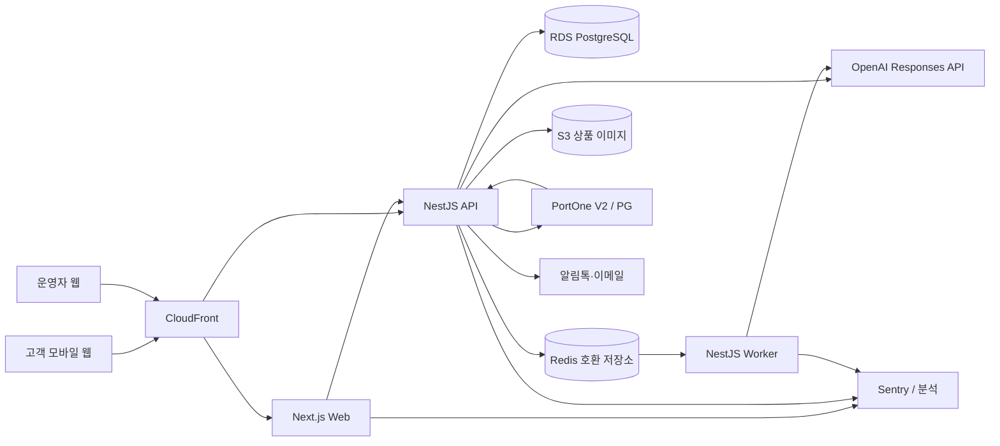

# AX4 기술 스택 결정안

- 문서 버전: v0.1
- 작성일: 2026-09-03
- 문서 상태: 검토 요청 초안
- 연계 문서: [PRD v0.2](./PRD%20v0.2.md)
- 적용 범위: 16주 MVP 및 출시 후 약 12개월
- 전제: 실제 구축이 아닌 기술 의사결정 단계

## 1. 결론 요약

AX4 MVP는 **TypeScript 기반 모듈형 모놀리스**로 구축한다. 웹과 API·워커는 배포 단위를 분리하지만, 저장소와 도메인 모델은 하나로 관리한다.

| 영역 | 권고 기술 | 결정 상태 |
|---|---|---|
| 언어·런타임 | TypeScript, Node.js 24 LTS | 권고 확정 후보 |
| 저장소 | pnpm workspace 모노레포, Turborepo | 권고 확정 후보 |
| 고객·운영자 웹 | Next.js App Router, React | 권고 확정 후보 |
| UI | Tailwind CSS, shadcn/ui | 권고 확정 후보 |
| 백엔드 | NestJS 모듈형 모놀리스 | 권고 확정 후보 |
| API | REST + OpenAPI, AI 응답은 SSE | 권고 확정 후보 |
| ORM | Prisma ORM 8 | 권고 확정 후보 |
| 주 데이터베이스 | Amazon RDS for PostgreSQL 18 | 권고 확정 후보 |
| 벡터 검색 | PostgreSQL `pgvector` | 권고 확정 후보 |
| 키워드 검색 | PostgreSQL exact match + `pg_trgm` | 권고 확정 후보 |
| 캐시·작업 큐 | Redis 호환 관리형 저장소 + BullMQ | 기술 스파이크 필요 |
| AI API | OpenAI Responses API | 권고 확정 후보 |
| 기본 AI 모델 | `gpt-5.4-mini` 고정 스냅샷 | 평가 후 확정 |
| 임베딩 | `text-embedding-3-small` | 평가 후 확정 |
| 결제 | PortOne V2 + 단일 국내 PG | 계약 후 확정 |
| 인증 | Auth.js + Kakao·Naver OAuth, 이메일 로그인 | 정책 검토 필요 |
| 파일·이미지 | Amazon S3 + CloudFront | 권고 확정 후보 |
| 실행 환경 | AWS 서울 리전, ECS on Fargate | 권고 확정 후보 |
| CI/CD | GitHub Actions + Amazon ECR | 권고 확정 후보 |
| IaC | AWS CDK with TypeScript | 팀 역량 확인 필요 |
| 오류·성능 관측 | Sentry + AWS CloudWatch | 권고 확정 후보 |
| 제품 분석 | GA4 + 서버 측 핵심 이벤트 저장 | 정책 검토 필요 |
| 단위·통합 테스트 | Vitest + Supertest | 권고 확정 후보 |
| E2E 테스트 | Playwright | 권고 확정 후보 |

## 2. 의사결정 목표

기술 스택은 다음 우선순위로 평가한다.

1. 5명 내외 팀이 16주 안에 MVP를 출시할 수 있어야 한다.
2. 주문, 결제, 재고 및 환불의 정합성을 AI와 분리해 보장해야 한다.
3. AI 추천 근거와 실행 기록을 감사할 수 있어야 한다.
4. 국내 사용자에게 안정적인 모바일 구매 경험을 제공해야 한다.
5. 초기 300~500개 SKU에서 불필요한 분산 시스템을 피해야 한다.
6. 제품 적합성 확인 후 트래픽과 상품 수 증가에 점진적으로 대응할 수 있어야 한다.
7. 특정 AI 모델 교체가 전체 커머스 도메인에 영향을 주지 않아야 한다.

## 3. 권고 아키텍처



### 3.1 배포 단위

코드베이스는 하나지만 실행 프로세스는 다음 세 개로 나눈다.

- `web`: 고객 웹과 운영자 화면을 제공하는 Next.js 애플리케이션
- `api`: 인증된 REST API, 주문·결제·상품·AI 도구 실행을 담당하는 NestJS 애플리케이션
- `worker`: 임베딩 생성, 상품 동기화, 알림, 재시도 작업을 처리하는 NestJS 워커

API와 워커는 같은 도메인 패키지를 사용한다. 독립 마이크로서비스로 분리하지 않는다.

## 4. 애플리케이션 구조

### 4.1 모노레포

권고 구조:

```text
apps/
  web/             # Next.js 고객·운영자 웹
  api/             # NestJS REST API
  worker/          # BullMQ 작업 소비자
packages/
  domain/          # 주문·상품·재고·회원 핵심 규칙
  contracts/       # API DTO, Zod 스키마, 이벤트 계약
  db/              # Prisma 스키마, 마이그레이션, DB 클라이언트
  ai/              # 모델 어댑터, 프롬프트, 도구, 평가
  ui/              # 공통 디자인 시스템
  config/          # ESLint, TypeScript 등 공통 설정
infra/
  cdk/             # AWS 인프라 정의
```

### 4.2 모듈 경계

NestJS 내부를 다음 도메인 모듈로 나눈다.

- Identity
- Customer
- Catalog
- Inventory
- Search
- Recommendation
- Cart
- Order
- Payment
- Fulfillment
- Return
- Promotion
- Review
- Conversation
- Notification
- Audit
- Admin

모듈 간 데이터베이스 테이블 직접 접근을 피하고 공개 서비스 또는 명시적 이벤트를 통해 협력한다. 이 경계를 유지하면 추후 트래픽이 큰 모듈만 별도 서비스로 분리할 수 있다.

## 5. 프론트엔드 결정

### 5.1 Next.js App Router

Next.js App Router를 사용한다. 공식 문서 기준 App Router는 Server Components, Suspense 및 Server Functions를 활용하며, 페이지와 레이아웃은 기본적으로 Server Components로 동작한다. 상품 목록과 상세 페이지의 초기 렌더링에 적합하고 상호작용이 필요한 부분만 Client Component로 제한할 수 있다. [Next.js App Router](https://nextjs.org/docs/app), [Server and Client Components](https://nextjs.org/docs/app/getting-started/server-and-client-components)

권고 원칙:

- 상품 상세, 카테고리 및 SEO 콘텐츠는 Server Component 우선
- 장바구니, 옵션 선택, 비교 UI 및 AI 채팅은 Client Component
- 고객 웹과 운영자 콘솔은 동일 앱에서 라우트 그룹으로 분리
- 비즈니스 로직은 Next.js Server Action이 아니라 NestJS 도메인 API에 위치
- 결제 완료 여부를 브라우저 리다이렉트 값만으로 확정하지 않음

### 5.2 상태 관리

- 서버 데이터: TanStack Query
- URL로 표현 가능한 검색 조건: URL search params
- 폼: React Hook Form + Zod
- 전역 클라이언트 상태: 기본 React 상태로 시작
- 장바구니의 최종 원천: 서버 데이터베이스

초기부터 Redux를 도입하지 않는다. 복잡한 장기 클라이언트 상태가 실제로 발생할 때 재검토한다.

### 5.3 UI와 접근성

- Tailwind CSS로 스타일 토큰 관리
- shadcn/ui를 코드 소유형 컴포넌트 출발점으로 사용
- Storybook은 공통 컴포넌트가 20개를 넘는 시점에 도입
- 모바일 Chrome과 Mobile Safari를 1차 브라우저로 간주
- 결제·주문·반품 흐름은 키보드와 스크린 리더 기준으로 검증

## 6. 백엔드 결정

### 6.1 NestJS 모듈형 모놀리스

프론트엔드와 같은 TypeScript 생태계를 사용해 팀의 전환 비용을 낮춘다. NestJS는 Redis 기반 BullMQ 통합을 공식 제공하며, 큐를 이용해 피크 부하와 장시간 작업을 HTTP 요청 경로에서 분리할 수 있다. [NestJS Queues](https://docs.nestjs.com/techniques/queues)

NestJS를 선택하는 이유:

- 도메인별 모듈 경계를 명시하기 쉽다.
- DI, validation, guard, interceptor 구조가 일관된다.
- REST/OpenAPI, 작업 큐 및 테스트 생태계가 충분하다.
- API와 워커가 같은 언어와 도메인 코드를 공유할 수 있다.

### 6.2 REST + OpenAPI

MVP에서는 GraphQL을 사용하지 않는다.

- 고객 웹과 운영자 웹이라는 제한된 클라이언트만 존재한다.
- 주문과 결제는 명확한 명령형 엔드포인트가 안전하다.
- OpenAPI 문서를 계약으로 사용해 프론트엔드 타입을 생성할 수 있다.
- CDN 캐시, 접근 로그 및 장애 분석이 단순하다.

AI 텍스트 스트리밍은 WebSocket 대신 SSE를 사용한다. 양방향 실시간 통신이 필요한 기능이 생기기 전에는 WebSocket을 도입하지 않는다.

### 6.3 거래 정합성

- 주문·결제·재고 변경은 PostgreSQL 트랜잭션으로 처리
- 모든 외부 웹훅은 서명 검증, 원문 보관 및 멱등성 키 적용
- 결제 승인 전 서버에서 상품 가격과 주문 금액 재계산
- 주문 상태 전이는 허용된 상태 머신으로 제한
- 외부 알림과 공급사 발송 요청은 transactional outbox 이후 큐 처리
- 작업 큐의 재시도를 고려해 모든 소비자를 멱등하게 구현

Prisma의 PostgreSQL 트랜잭션은 여러 쓰기를 하나의 단위로 커밋하거나 롤백하도록 지원한다. [Prisma Transactions](https://www.prisma.io/docs/orm/fundamentals/transactions)

## 7. 데이터 및 검색 결정

### 7.1 PostgreSQL 단일 원천

MVP의 데이터 원천은 Amazon RDS for PostgreSQL 하나로 통합한다.

- 회원, 상품, 옵션, 재고, 주문, 결제, 배송, 환불
- AI 대화 메타데이터와 추천 결과
- 감사 로그와 도메인 이벤트
- 상품 및 리뷰 임베딩

MongoDB, 전용 벡터 DB 및 데이터 웨어하우스는 MVP에서 사용하지 않는다.

### 7.2 ORM

Prisma ORM 8을 기본 ORM으로 사용하고, 복잡한 검색·집계·락은 검토된 raw SQL 또는 SQL 빌더로 처리한다. Prisma 8 공식 문서는 PostgreSQL을 주요 지원 대상으로 안내하며 트랜잭션을 제공한다. [Prisma PostgreSQL Quickstart](https://www.prisma.io/docs/prisma-orm/quickstart/postgresql)

다음 작업은 ORM 편의 기능보다 데이터베이스 정확성을 우선한다.

- 재고 차감
- 주문 상태 전이
- 결제 웹훅 처리
- 환불 금액 합계 검증
- 검색 랭킹 쿼리
- outbox 잠금 및 소비

### 7.3 검색

MVP 검색은 다음 순서로 작동한다.

```text
사용자 문장
  → AI가 조건을 구조화된 JSON으로 변환
  → PostgreSQL 속성 필터
  → 상품명·브랜드·모델 exact/trigram 검색
  → pgvector 의미 유사도
  → 재고·가격·사업 규칙 재정렬
  → 3~5개 후보와 근거 생성
```

`pgvector`는 PostgreSQL 안에서 exact 및 approximate nearest-neighbor 검색과 cosine distance 등을 지원한다. Amazon RDS for PostgreSQL도 pgvector 확장 버전을 제공한다. [pgvector 프로젝트](https://github.com/pgvector/pgvector), [Amazon RDS PostgreSQL 확장 목록](https://docs.aws.amazon.com/AmazonRDS/latest/PostgreSQLReleaseNotes/postgresql-extensions.html)

### 7.4 OpenSearch 도입 유예

초기 300~500개 SKU에서는 OpenSearch가 제공하는 이점보다 운영 복잡도와 비용이 크다고 판단한다. 다음 중 하나가 발생하면 도입을 재검토한다.

- 판매 SKU 50,000개 이상
- 검색 p95가 500ms를 반복적으로 초과
- 한국어 형태소 분석, 동의어, 철자 보정 품질이 PostgreSQL로 목표에 미달
- 검색 분석과 상품 노출 제어가 전용 검색 인프라를 요구
- 벡터·키워드 하이브리드 검색의 DB 부하가 주문 트랜잭션에 영향을 줌

## 8. AI 스택 결정

### 8.1 API와 모델

- API: OpenAI Responses API
- SDK: 공식 OpenAI TypeScript SDK
- 기본 모델 후보: `gpt-5.4-mini-2026-03-17`
- 복잡한 추천 판단의 승격 후보: `gpt-5.4`
- 임베딩 후보: `text-embedding-3-small`
- 출력 계약: JSON Schema 기반 Structured Outputs
- 외부 데이터 접근: allowlist 방식의 function calling

OpenAI 공식 문서에 따르면 Responses API는 텍스트·JSON 출력과 사용자 정의 함수 호출을 지원한다. GPT-5.4 mini는 스트리밍, function calling 및 Structured Outputs를 지원하고, 고정 스냅샷을 제공한다. [Responses API](https://developers.openai.com/api/reference/cli/resources/responses/methods/create), [GPT-5.4 mini](https://developers.openai.com/api/docs/models/gpt-5.4-mini)

`text-embedding-3-small`은 검색, 추천, 군집화 및 분류 용도의 텍스트 임베딩 모델로 안내된다. 상품 수가 작은 MVP에서는 먼저 이 모델로 평가하고, 검색 품질이 목표에 미달할 때만 large 모델을 검토한다. [text-embedding-3-small](https://developers.openai.com/api/docs/models/text-embedding-3-small)

### 8.2 모델 선택 원칙

모델명은 코드 전역에 직접 넣지 않고 모델 레지스트리 설정으로 관리한다.

```text
intent_extraction     → gpt-5.4-mini snapshot
recommendation        → gpt-5.4-mini snapshot
recommendation_retry  → gpt-5.4
review_summary        → gpt-5.4-mini snapshot / 비동기
embedding             → text-embedding-3-small
```

처음부터 다중 모델 라우팅을 복잡하게 구현하지 않는다. 출시 전 평가 세트에서 기본 모델의 정확도와 지연을 측정한 뒤, 실패 사례에 한해 상위 모델 승격을 적용한다.

### 8.3 AI 오케스트레이션

MVP에서는 LangChain이나 LlamaIndex를 핵심 런타임 의존성으로 사용하지 않는다.

- 공식 SDK를 얇은 `AIProvider` 어댑터로 감싼다.
- 프롬프트, 모델 설정, 도구 스키마를 버전 관리한다.
- Zod/JSON Schema로 입력과 출력을 검증한다.
- 도구 호출 횟수와 허용 도구를 요청별로 제한한다.
- 모델 출력은 제안으로 취급하고 서버가 권한과 도메인 규칙을 다시 검사한다.

허용 도구 예시:

- `search_products`
- `get_product_details`
- `compare_products`
- `get_inventory`
- `get_delivery_estimate`
- `get_return_policy`
- `draft_cart`

`place_order`, `capture_payment`, `cancel_order`, `issue_refund`는 AI가 직접 호출할 수 있는 도구로 노출하지 않는다. 사용자 승인 이후 일반 애플리케이션 명령 API가 실행한다.

### 8.4 대화와 개인정보

- Responses API 요청은 기본적으로 `store: false`
- 대화 상태는 AX4 데이터베이스가 관리
- 모델에 전달하기 전 전화번호, 주소, 이메일 및 주문자 식별정보 제거
- 상품 검색에는 익명화된 선호 속성만 전달
- 원문 대화 보관 기간과 사용자 삭제 정책을 별도로 정의
- API 키는 브라우저에 노출하지 않고 서버에서만 사용

OpenAI API 입력은 사용자가 명시적으로 옵트인하지 않는 한 모델 학습에 사용되지 않지만, 기본 abuse monitoring 로그에는 고객 콘텐츠가 최대 30일 보관될 수 있다. Zero Data Retention은 별도 승인 대상이므로 `store: false`만으로 ZDR과 동일하다고 간주해서는 안 된다. [OpenAI API 데이터 통제](https://platform.openai.com/docs/models/default-usage-policies-by-endpoint)

### 8.5 AI 평가

출시 전에 최소 200개의 한국어 골든 시나리오를 만든다.

- 조건 추출 정확도
- 필수 질문 누락률
- 추천 상품의 조건 충족률
- 존재하지 않는 속성 생성률
- 가격·재고·배송 사실 오류율
- 의료적 표현 위반률
- 도구 호출 성공률
- 첫 응답 시간과 전체 추천 시간
- 호출당 토큰 및 비용

자동 평가 점수만 사용하지 않고 러닝 상품 담당자의 블라인드 평가를 병행한다. 프롬프트나 모델 스냅샷 변경은 동일 평가 세트를 통과한 후 배포한다.

## 9. 인증 및 권한

### 9.1 고객 인증

- Auth.js를 Next.js 인증 계층으로 사용
- Kakao 로그인을 P0로 제공
- 이메일 로그인 또는 일회용 링크를 복구 경로로 제공
- Naver 로그인은 계약·검수 일정에 따라 P0 또는 P1
- 배송 연락처는 로그인 식별자와 별도로 주문 시 검증
- 세션은 서버 검증 가능한 안전한 쿠키 사용

Auth.js는 Kakao와 Naver OAuth provider를 기본 제공한다. [Auth.js Kakao provider](https://authjs.dev/reference/core/providers/kakao), [Auth.js Naver provider](https://authjs.dev/reference/core/providers/naver)

### 9.2 운영자 권한

- 역할: `customer`, `operator`, `catalog_manager`, `cs_agent`, `admin`
- 운영자 계정은 고객 계정과 권한 경계를 분리
- 운영자 다중 인증 필수
- 가격·환불·재고 조정은 감사 로그 기록
- 고액 환불과 대량 가격 변경은 2인 승인 정책 검토

## 10. 결제 및 외부 연동

### 10.1 결제

- PortOne V2 SDK와 서버 API 사용
- MVP는 국내 PG 하나만 계약
- 카드와 주요 간편결제부터 시작
- 결제 요청 금액은 서버가 생성
- 리다이렉트 결과가 아닌 서버 승인 조회와 웹훅으로 상태 확정
- `merchant_uid` 또는 내부 결제 시도 ID에 유일성 제약 적용
- 모든 취소·부분 환불 요청을 멱등하게 처리

PortOne V2는 다양한 PG의 결제창을 통일된 SDK 방식으로 호출할 수 있다. 초기에는 하나의 PG만 사용하되, 통합 계층을 두어 향후 변경 비용을 낮춘다. [PortOne V2 결제 연동](https://developers.portone.io/opi/ko/integration/start/v2/checkout?v=v2)

### 10.2 공급사·배송·알림

- MVP 공급사 연동: CSV 업로드와 운영자 승인
- 재고 동기화: 초기 배치 처리, 핵심 상품은 짧은 갱신 주기 적용
- 배송: 택배사 코드와 송장번호를 표준화해 배송조회 API 연동
- 알림: 알림톡 우선, 실패 시 SMS 또는 이메일 fallback
- 외부 연동은 adapter interface 뒤에 배치해 사업자 교체 가능성을 확보

실제 배송조회와 알림 사업자는 계약 조건, SLA, 개인정보 처리 위치를 비교한 뒤 확정한다.

## 11. 클라우드 및 배포

### 11.1 AWS 서울 리전

- 기본 리전: `ap-northeast-2`
- 컨테이너: ECS on Fargate
- 이미지 저장: ECR
- 데이터베이스: RDS for PostgreSQL
- 캐시·큐: ElastiCache 계열 Redis 호환 서비스
- 파일: S3
- CDN: CloudFront
- 비밀정보: Secrets Manager
- 로그·메트릭: CloudWatch
- 방화벽·기본 보호: AWS WAF

ECS는 Fargate를 통해 서버 관리 없이 컨테이너 작업을 실행할 수 있고, CloudFront는 S3 또는 HTTP origin의 콘텐츠를 엣지에서 전달한다. [Amazon ECS](https://docs.aws.amazon.com/AmazonECS/latest/APIReference/Welcome.html), [Amazon CloudFront](https://docs.aws.amazon.com/AmazonCloudFront/latest/DeveloperGuide/Introduction.html)

### 11.2 환경

- `local`: Docker Compose 기반 개발 환경
- `dev`: 공유 개발 및 외부 API sandbox
- `staging`: 운영과 동일 구조, 축소 용량
- `production`: 운영 데이터와 키 완전 분리

운영 DB에 개발자가 직접 접속하는 것을 기본 금지하고, 제한된 break-glass 절차만 제공한다.

### 11.3 CI/CD

- Pull Request: lint, typecheck, unit, integration, migration 검증
- main 병합: 컨테이너 빌드, 보안 스캔, staging 자동 배포
- production: 승인 후 점진 배포
- DB migration: 배포와 호환되는 expand/contract 방식
- 결제와 주문 모듈 변경: E2E 및 회귀 테스트 통과 필수
- 배포 산출물은 commit SHA로 추적

## 12. 관측성 및 분석

### 12.1 기술 관측성

- Sentry: 웹·API 예외, 성능 trace, release 비교
- CloudWatch: 컨테이너, DB, 로드밸런서, 큐 및 인프라 로그·메트릭
- 모든 요청에 `request_id`, 주문에 `order_id`, AI 호출에 `ai_run_id` 부여
- 로그에 비밀번호, 세션 토큰, 주소, 전화번호 및 전체 AI 원문 기록 금지
- AI 호출의 모델, 프롬프트 버전, 지연, 토큰, 비용 및 도구 결과 코드 기록

### 12.2 제품 분석

- GA4로 익명·동의 기반 퍼널 분석
- 결제 완료, 환불 및 AI 추천 결과는 서버 이벤트로 별도 저장
- 분석 도구 값은 매출·주문 정산의 원천으로 사용하지 않음
- PRD의 이벤트 이름과 속성을 중앙 이벤트 계약으로 관리

## 13. 테스트 전략

| 레벨 | 도구 | 필수 범위 |
|---|---|---|
| 정적 검사 | TypeScript, ESLint | 전 코드 |
| 단위 테스트 | Vitest | 가격, 할인, 재고, 주문 상태, 환불 계산 |
| 통합 테스트 | Vitest, Supertest, Testcontainers | DB 트랜잭션, 웹훅, outbox, API 권한 |
| 계약 테스트 | OpenAPI schema | 웹·API DTO 호환성 |
| E2E | Playwright | 로그인, 탐색, AI 추천, 장바구니, 결제 sandbox, 취소 |
| AI 평가 | 자체 평가 harness | 골든 시나리오, 사실성, 안전성, 비용·지연 |
| 부하 테스트 | k6 | 검색, 상품 상세, 장바구니, 결제 승인 콜백 |

Playwright는 Chromium, Firefox, WebKit 및 모바일 환경 에뮬레이션을 지원하므로 모바일 우선 구매 흐름의 회귀 테스트에 사용한다. [Playwright 브라우저 지원](https://playwright.dev/docs/browsers)

출시 차단 테스트:

- 중복 결제 요청이 주문을 두 번 생성하지 않음
- 동일 웹훅이 반복 수신되어도 상태가 한 번만 변경됨
- 결제 도중 가격 또는 재고가 바뀌면 안전하게 중단됨
- AI가 존재하지 않는 SKU를 장바구니에 넣지 못함
- AI가 주문·환불 명령을 직접 실행하지 못함
- 개인정보가 AI 요청과 로그에서 마스킹됨

## 14. 의도적으로 채택하지 않는 기술

| 기술·방식 | MVP에서 제외하는 이유 | 재검토 시점 |
|---|---|---|
| 마이크로서비스 | 팀과 트래픽 대비 배포·관측 복잡도가 큼 | 모듈별 독립 확장 필요 시 |
| Kubernetes | ECS Fargate로 필요한 격리와 확장 충족 | 다수 서비스와 플랫폼 팀 형성 시 |
| GraphQL | 클라이언트가 적고 거래 API가 명령 중심 | 외부 파트너 API 또는 다수 앱 등장 시 |
| OpenSearch | 300~500 SKU에 과도한 운영 비용 | 검색 품질·규모 임계치 초과 시 |
| 전용 벡터 DB | PostgreSQL과 데이터 일관성 유지가 더 중요 | 수백만 벡터 또는 독립 확장 필요 시 |
| Kafka | BullMQ와 outbox로 초기 비동기 요구 충족 | 높은 이벤트 처리량·다수 소비자 발생 시 |
| 다중 클라우드 | 장애 대비 효과보다 운영 복잡도가 큼 | 규제·대형 계약 요구 시 |
| LangChain/LlamaIndex 핵심 의존 | 단순 도구 흐름에 추상화·업그레이드 비용 증가 | 복잡한 agent graph가 검증된 뒤 |
| Redux | 초기 전역 클라이언트 상태가 제한적 | UI 상태 복잡성 측정 후 |

## 15. 기술 전환 기준

다음 지표를 월별로 검토한다.

- API p95 및 p99 응답 시간
- 검색 p95와 검색 결과 없음 비율
- DB CPU, connection, lock wait 및 slow query
- 큐 지연, 실패 및 재시도 횟수
- AI 첫 토큰 시간과 전체 응답 시간
- AI 호출 성공률, 비용 및 상위 모델 승격률
- 추천 조건 충족률과 사실 오류율
- 결제 웹훅 처리 지연과 중복률
- 배포 빈도, 실패율 및 복구 시간

스케일 문제가 발생해도 먼저 쿼리, 인덱스, 캐시 및 비동기 처리를 개선한 뒤 서비스 분리를 검토한다.

## 16. 16주 기술 검증 순서

| 시점 | 검증 항목 | 통과 기준 |
|---|---|---|
| 1~2주 | Next.js–NestJS 계약, 인증, CI | 개발·staging 배포와 로그인 성공 |
| 2~3주 | 주문·재고 트랜잭션 | 동시 주문에서 초과 판매 방지 |
| 3~4주 | PostgreSQL 검색·pgvector | 500 SKU 기준 p95 300ms 이하 |
| 4~5주 | AI 조건 추출·추천 | 초기 골든셋 조건 충족률 90% 이상 |
| 6~7주 | PortOne sandbox | 성공·실패·중복·취소 처리 검증 |
| 8~10주 | AI 스트리밍·도구 권한 | 금지 명령 실행 0건 |
| 11~12주 | 공급사·배송 작업 큐 | 실패 재시도와 운영자 재처리 가능 |
| 13~14주 | E2E·부하·보안 | 출시 차단 시나리오 전부 통과 |
| 15주 | 비공개 베타 관측성 | 오류 원인과 AI run 추적 가능 |

## 17. 주요 리스크

| 리스크 | 대응 |
|---|---|
| TypeScript 단일 언어가 AI 실험을 제한 | Python 실험은 오프라인 허용, 운영 API 계약은 언어 중립적으로 유지 |
| PostgreSQL 검색의 한국어 품질 부족 | 상품 alias 사전, 구조화 조건, trigram, vector 순으로 보완 후 OpenSearch 검토 |
| 외부 AI 모델 변경으로 추천 품질 변동 | 고정 스냅샷, 골든 평가, prompt/model version 기록 |
| Redis 작업 중복 처리 | 멱등 소비자, DB unique key, outbox 상태 관리 |
| Auth.js OAuth provider 변화 | 인증 adapter와 계정 테이블을 도메인에서 분리 |
| AWS 운영 부담 | CDK 표준화, 관리형 서비스, 최소 배포 단위 유지 |
| 개인정보의 국외 처리 | 최소 전송, 비식별화, 동의·처리방침 검토, ZDR 가능성 확인 |
| 기술 스택이 팀 역량과 불일치 | 개발 시작 전 1주 기술 스파이크와 담당자 인터뷰 |

## 18. 검토가 필요한 결정

다음 다섯 항목은 제품 책임자와 개발 책임자의 승인 후 v1.0에서 고정한다.

1. **AWS 우선 전략:** 초기 비용보다 운영 표준성과 국내 리전 구성을 우선할지
2. **인증 범위:** Kakao + 이메일로 출시하고 Naver를 P1으로 미룰지
3. **AI 모델:** `gpt-5.4-mini`를 기본 모델로 승인하고 평가 실패 사례만 상위 모델로 보낼지
4. **데이터 정책:** AI 대화 원문 보관 여부와 보관 기간을 어떻게 정할지
5. **분석 도구:** GA4로 시작할지, 제품 분석 전용 도구를 추가할지

## 19. 최종 권고

AX4의 기술적 차별점은 프레임워크 수가 아니라 다음 세 가지에 있어야 한다.

1. 러닝 상품 데이터를 정확하고 구조적으로 관리하는 카탈로그
2. 사용자 조건을 상품 속성으로 변환하고 근거를 남기는 AI 추천 계층
3. AI와 분리된 안전한 주문·결제 상태 머신

따라서 MVP는 `Next.js + NestJS + PostgreSQL/pgvector + OpenAI Responses API + AWS` 조합으로 시작하고, 검색 엔진·벡터 DB·마이크로서비스는 측정된 필요가 생길 때 도입하는 것을 권고한다.

## 20. 주요 조사 자료

- [Next.js App Router 공식 문서](https://nextjs.org/docs/app)
- [NestJS BullMQ 큐 공식 문서](https://docs.nestjs.com/techniques/queues)
- [Prisma PostgreSQL 공식 문서](https://www.prisma.io/docs/prisma-orm/quickstart/postgresql)
- [pgvector 공식 프로젝트](https://github.com/pgvector/pgvector)
- [Amazon RDS PostgreSQL 확장 목록](https://docs.aws.amazon.com/AmazonRDS/latest/PostgreSQLReleaseNotes/postgresql-extensions.html)
- [Amazon ECS 공식 문서](https://docs.aws.amazon.com/AmazonECS/latest/APIReference/Welcome.html)
- [OpenAI Responses API 공식 문서](https://developers.openai.com/api/reference/cli/resources/responses/methods/create)
- [OpenAI GPT-5.4 mini 모델 문서](https://developers.openai.com/api/docs/models/gpt-5.4-mini)
- [OpenAI API 데이터 통제 문서](https://platform.openai.com/docs/models/default-usage-policies-by-endpoint)
- [PortOne V2 결제 연동 문서](https://developers.portone.io/opi/ko/integration/start/v2/checkout?v=v2)
- [Playwright 공식 문서](https://playwright.dev/docs/browsers)

---

검토 의견을 반영한 다음 버전에서는 승인된 스택, 대안 비교 점수, 예상 월간 인프라 비용, 데이터 흐름 및 보안 위협 모델을 구체화한다.
