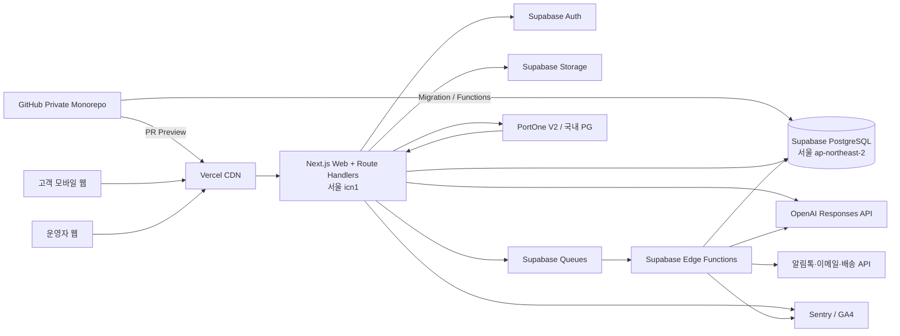

# AX4 기술 스택 결정안

- 문서 버전: v0.2
- 작성일: 2026-09-03
- 문서 상태: Supabase-first 검토안
- 이전 버전: [AX4 기술 스택 결정안 v0.1](./AX4%20기술%20스택%20결정안%20v0.1.md)
- 연계 문서: [PRD v0.2](./PRD%20v0.2.md)
- 적용 범위: 16주 MVP 및 출시 후 약 12개월
- 전제: 실제 구축이 아닌 기술 의사결정 단계

## 1. 변경 요약

v0.1의 AWS 중심 구성을 **Supabase-first 구성**으로 변경한다.

| v0.1 | v0.2 결정 |
|---|---|
| AWS RDS PostgreSQL | Supabase PostgreSQL 서울 리전 |
| Auth.js | Supabase Auth |
| Amazon S3 + CloudFront | Supabase Storage + CDN |
| Redis + BullMQ | Supabase Queues(`pgmq`) |
| NestJS API | Next.js Route Handlers 기반 서버 API |
| NestJS Worker | Supabase Edge Functions + Queues/Cron |
| ECS on Fargate | Vercel Functions 서울 리전 |
| AWS CDK | Supabase CLI + SQL migration + Vercel 설정 |
| AWS 다중 계정 | Supabase 개발·스테이징·운영 프로젝트 분리 |

AWS는 MVP 필수 인프라에서 제외하고, Supabase 또는 Vercel의 제약이 측정되었을 때 선택할 수 있는 성장 단계 대안으로 남긴다.

## 2. 결론 요약

AX4 MVP는 **Next.js와 Supabase를 중심으로 한 TypeScript 모듈형 모놀리스**로 구축한다.

| 영역 | 권고 기술 | 결정 상태 |
|---|---|---|
| 언어·런타임 | TypeScript, Node.js 24 LTS | 권고 확정 |
| 저장소 | pnpm workspace 모노레포, Turborepo | 권고 확정 |
| 소스 관리 | GitHub Organization private monorepo | 승인 확정 |
| 개발 방식 | Trunk-based development + Pull Request | 승인 확정 |
| CI | GitHub Actions | 승인 확정 |
| 고객·운영자 웹 | Next.js App Router, React | 권고 확정 |
| 동기 서버 API | Next.js Route Handlers, REST | 권고 확정 |
| AI 응답 스트리밍 | Server-Sent Events(SSE) | 권고 확정 |
| 비동기 처리 | Supabase Queues + Edge Functions + Cron | 기술 스파이크 후 확정 |
| UI | Tailwind CSS, shadcn/ui + Base UI | 승인 확정 |
| 주 데이터베이스 | Supabase PostgreSQL, 서울 리전 | 권고 확정 |
| ORM | Prisma ORM 8, 서버 전용 | 권고 확정 |
| 벡터 검색 | Supabase PostgreSQL `pgvector` | 권고 확정 |
| 키워드 검색 | PostgreSQL exact match + `pg_trgm` | 권고 확정 |
| 인증 | Supabase Auth, Kakao + 이메일 | 권고 확정 |
| 파일·이미지 | Supabase Storage + CDN | 권고 확정 |
| 웹·API 배포 | Vercel, 서울 `icn1` | 승인 확정 |
| AI API | OpenAI Responses API | 권고 확정 |
| 기본 AI 모델 | `gpt-5.4-mini` 고정 스냅샷 | 평가 후 확정 |
| 임베딩 | `text-embedding-3-small` | 평가 후 확정 |
| 결제 | PortOne V2 + 단일 국내 PG | 계약 후 확정 |
| 오류·성능 관측 | Sentry + Vercel/Supabase Logs | 권고 확정 후보 |
| 제품 분석 | GA4 + 서버 측 핵심 이벤트 | 정책 검토 필요 |
| 테스트 | Vitest, Playwright, Testcontainers | 권고 확정 |

## 3. Supabase-first 선택 이유

### 3.1 제품 개발에 집중

5명 내외 팀이 RDS, Redis, S3, 인증, 컨테이너 및 VPC를 각각 구성하는 대신 하나의 관리형 플랫폼에서 데이터 기반 기능을 시작할 수 있다.

Supabase 프로젝트는 PostgreSQL을 중심으로 Auth, Storage, Realtime 및 Edge Functions를 제공한다. 데이터베이스는 PostgreSQL 추상 계층이 아닌 실제 PostgreSQL이며, pgvector 등 확장을 사용할 수 있다. [Supabase Database](https://supabase.com/docs/guides/database/overview)

### 3.2 국내 사용자와 데이터 위치

Supabase는 서울 `ap-northeast-2`를 특정 프로젝트 리전으로 제공한다. Vercel도 서울 `icn1` 컴퓨트 리전을 제공하므로 웹 서버와 데이터베이스를 같은 지역에 배치할 수 있다. [Supabase 리전](https://supabase.com/docs/guides/platform/regions), [Vercel 리전](https://vercel.com/docs/regions)

### 3.3 단계적 확장

MVP에서는 PostgreSQL과 Supabase 관리 기능을 사용하되 핵심 도메인을 순수 TypeScript와 표준 SQL로 유지한다. 이렇게 하면 추후 Supabase PostgreSQL을 AWS RDS 또는 다른 PostgreSQL로 이전할 수 있다.

## 4. 권고 아키텍처



### 4.1 실행 단위

- `web`: 고객 쇼핑몰과 운영자 콘솔
- `server`: Next.js Route Handlers로 제공하는 동기 REST API와 AI SSE
- `edge-functions`: 큐 소비, 스케줄 작업, 외부 API 재시도
- `postgres`: 주문·결제·재고를 포함한 최종 데이터 원천

NestJS와 독립 컨테이너 서버는 MVP에서 사용하지 않는다.

## 5. 저장소 및 코드 구조

```text
apps/
  web/                     # Next.js 고객·운영자 웹과 Route Handlers
packages/
  domain/                  # 가격·재고·주문·환불 순수 도메인 규칙
  contracts/               # Zod 스키마, API DTO, 이벤트 계약
  db/                      # Prisma client와 query repository
  ai/                      # 모델 어댑터, 프롬프트, 도구, 평가
  ui/                      # 공통 디자인 시스템
  config/                  # TypeScript, ESLint, 테스트 설정
supabase/
  migrations/              # SQL migration과 RLS 정책
  functions/               # Edge Functions
  seed.sql                  # 비운영 샘플 데이터
docs/
  adr/                     # 주요 기술 의사결정 기록
```

### 5.1 설계 규칙

- UI와 Route Handler에 가격·재고·주문 규칙을 직접 작성하지 않는다.
- 핵심 규칙은 `packages/domain`에 둔다.
- 데이터베이스 접근은 `packages/db` repository를 거친다.
- AI 프롬프트와 도구가 Prisma를 직접 호출하지 않는다.
- Edge Function과 Next.js가 동일한 도메인 계약을 사용한다.
- Supabase Dashboard에서 운영 스키마를 직접 수정하지 않는다.
- 모든 스키마 변경은 버전 관리된 migration으로 수행한다.

### 5.2 GitHub 저장소와 개발 방식

AX4 소스 코드는 회사 소유 GitHub Organization의 **private monorepo 하나**에서 관리한다. 개인 계정 소유 repository와 여러 기능별 repository로 나누지 않는다.

브랜치 전략은 trunk-based development를 사용한다.

- `main`: 항상 배포 가능한 유일한 장기 브랜치
- 기능 브랜치: `feat/<ticket>-<summary>`
- 수정 브랜치: `fix/<ticket>-<summary>`
- 긴 `develop` 브랜치는 만들지 않음
- 기능 브랜치는 가급적 1~3일 안에 Pull Request로 병합
- 미완성 기능은 장기 브랜치 대신 feature flag로 격리
- `main` 직접 push 금지
- 병합 방식은 squash merge를 기본값으로 사용
- production release는 Git commit SHA와 날짜 기반 tag로 추적

GitHub Organization과 repository는 회사 관리 메일과 최소 2명의 Owner를 사용하며, 모든 구성원에게 2FA를 요구한다.

### 5.3 Pull Request와 소유권

`main` ruleset에 다음 규칙을 적용한다.

- 모든 변경은 Pull Request를 통해 병합
- 최소 1명의 승인 필요
- 결제, 주문, 인증, RLS, migration 및 GitHub Actions 변경은 CODEOWNER 승인 필수
- 새 commit이 추가되면 기존 승인을 무효화
- 모든 review conversation 해결 필수
- 필수 status check 통과 전 병합 금지
- force push와 branch 삭제 금지
- 관리자 우회는 장애 복구 상황으로 제한하고 감사 기록 남김

필수 status check:

- `lint`
- `typecheck`
- `unit-test`
- `db-test`
- `build`
- `migration-check`
- `secret-scan`
- `vercel-preview`

GitHub ruleset은 Pull Request 승인, CODEOWNER 검토 및 필수 status check 통과를 병합 조건으로 지정할 수 있다. [GitHub Rulesets](https://docs.github.com/en/repositories/configuring-branches-and-merges-in-your-repository/managing-rulesets/available-rules-for-rulesets)

권고 CODEOWNERS 범위:

```text
/packages/domain/order/       @ax4/backend
/packages/domain/payment/     @ax4/backend @ax4/security
/packages/ai/                 @ax4/ai
/packages/ui/                 @ax4/frontend @ax4/design
/supabase/migrations/         @ax4/backend @ax4/security
/supabase/functions/          @ax4/backend
/.github/workflows/           @ax4/platform @ax4/security
```

실제 팀 이름은 GitHub Organization 구성 후 확정한다.

## 6. 프론트엔드 및 동기 API

### 6.1 Next.js App Router

Next.js App Router를 사용한다. 상품 목록·상세와 SEO 콘텐츠는 Server Component를 우선하고, 장바구니·옵션 선택·비교·AI 채팅만 Client Component로 구현한다. Next.js 공식 문서는 App Router가 Server Components, Suspense 및 Server Functions를 활용한다고 설명한다. [Next.js App Router](https://nextjs.org/docs/app)

### 6.2 Route Handlers

Next.js Route Handlers가 다음 서버 기능을 담당한다.

- 상품 검색과 상세 조회
- 장바구니 변경
- 주문 생성
- 결제 준비와 승인 확인
- PortOne/PG 웹훅 수신
- 주문·배송·반품 조회
- AI 대화 및 SSE 스트리밍
- 운영자 명령

Route Handler는 요청 검증, 인증, 권한 확인, 도메인 서비스 호출과 응답 변환만 담당한다.

### 6.3 API 방식

- 고객·운영자 API: REST
- AI 스트리밍: SSE
- 입력·출력 검증: Zod
- API 문서: Zod 기반 OpenAPI 생성
- 브라우저 호출: same-origin 우선
- 내부 데이터 변경: 명시적 command endpoint

GraphQL과 WebSocket은 MVP에서 사용하지 않는다.

### 6.4 상태 관리

- 서버 데이터: TanStack Query
- 검색 및 필터 상태: URL search params
- 폼: React Hook Form + Zod
- 장바구니 최종 원천: PostgreSQL
- 전역 UI 상태: 기본 React 상태로 시작

Redux는 실제 복잡성이 확인될 때까지 도입하지 않는다.

### 6.5 UI 컴포넌트 기반

AX4 디자인 시스템의 출발점으로 **shadcn/ui + Base UI + Tailwind CSS** 조합을 사용한다.

shadcn/ui는 일반적인 폐쇄형 컴포넌트 패키지가 아니라 실제 컴포넌트 코드를 프로젝트에 추가하고 직접 소유·수정하는 방식이다. AX4는 이를 완성된 디자인 시스템이 아니라 제품 전용 UI를 구축하기 위한 코드 기반으로 사용한다. [shadcn/ui 소개](https://ui.shadcn.com/docs)

2026년 7월부터 shadcn/ui 신규 프로젝트의 기본 primitive는 Base UI이며, 공식 문서도 신규 프로젝트에 Base UI 사용을 권장한다. Radix는 기존 프로젝트와 호환을 위해 계속 지원되지만 AX4 신규 구축에는 Base UI를 선택한다. [Base UI 기본 전환 안내](https://ui.shadcn.com/docs/changelog/2026-07-base-ui-default)

적용 원칙:

- shadcn/ui 초기 설정에서 Base UI를 명시적으로 고정한다.
- 공식 shadcn/ui registry의 필요한 컴포넌트만 추가한다.
- 외부 community registry 코드는 라이선스, 의존성, 보안 및 접근성을 검토한 뒤 사용한다.
- 설치된 컴포넌트 코드는 `packages/ui`에서 AX4가 직접 소유한다.
- 업스트림 변경을 자동 병합하지 않고 변경 내역과 회귀 테스트를 확인한다.
- 색상, 간격, 타이포그래피, radius 및 상태 표현을 디자인 토큰으로 관리한다.
- 상품·주문·결제의 비즈니스 로직을 UI 컴포넌트 안에 넣지 않는다.
- 컴포넌트 변형은 공통 variant 체계를 따르고 화면별 임의 복제를 피한다.

shadcn/ui가 제공하는 기본 컴포넌트를 조합해 다음 AX4 전용 컴포넌트를 별도로 설계한다.

- 상품 카드와 상품 이미지 갤러리
- 가격·할인·품절 상태 표시
- 색상·사이즈·수량 선택기
- 상품 비교표
- 장바구니 drawer와 주문 요약
- 결제 단계 표시와 오류 복구 UI
- AI 추천 카드, 추천 근거 및 주의점 표시
- 배송·취소·반품 상태 표시

접근성 기준:

- 키보드만으로 탐색·옵션 선택·장바구니·결제를 완료할 수 있어야 한다.
- dialog, drawer, combobox 및 dropdown의 포커스 이동과 복귀를 검증한다.
- 오류 메시지를 색상에만 의존하지 않고 텍스트와 ARIA 관계로 제공한다.
- 가격 변동, 품절 및 AI 스트리밍 상태를 보조기술에 전달한다.
- 자동 접근성 검사와 수동 키보드·스크린 리더 검사를 병행한다.
- 모바일 Chrome과 Mobile Safari에서 결제 흐름을 회귀 테스트한다.

React Aria는 shadcn/ui의 선택 가능한 기반이지만 통합 시점이 비교적 최근이므로 MVP 기본값에서 제외한다. 특정 접근성 요구를 Base UI로 충족하기 어려운 경우 해당 컴포넌트 단위로 재검토한다. [React Aria 지원 안내](https://ui.shadcn.com/docs/changelog/2026-07-react-aria)

## 7. Supabase 데이터베이스

### 7.1 프로젝트와 리전

- 운영 프로젝트: 서울 `ap-northeast-2`
- 스테이징 프로젝트: 서울 `ap-northeast-2`
- 로컬 개발: Supabase CLI 기반 로컬 스택
- 운영과 스테이징의 키, 사용자, Storage 및 데이터 완전 분리

일반 APAC 리전이 아니라 서울 특정 리전을 명시적으로 선택한다.

### 7.2 데이터 원천

PostgreSQL을 다음 데이터의 최종 원천으로 사용한다.

- 회원 프로필과 동의 이력
- 상품, 옵션, 가격 및 재고
- 장바구니
- 주문, 결제 시도 및 환불
- 배송과 반품
- 리뷰
- AI 대화 메타데이터와 추천 결과
- 감사 로그와 도메인 이벤트
- 상품 및 리뷰 임베딩

분석 도구, AI 모델 및 PortOne 응답을 주문 상태의 최종 원천으로 사용하지 않는다.

### 7.3 Prisma 연결

Prisma ORM을 Next.js 서버에서만 사용한다. Supabase는 Prisma 연결과 Supavisor pooler 사용 방법을 공식 제공한다. [Supabase Prisma 가이드](https://supabase.com/docs/guides/database/prisma)

권고 연결 방식:

- Vercel Functions: Supavisor transaction pooler
- migration: 제한된 직접 또는 session 연결
- 운영 API: 최소 권한 `app_server` DB role
- 브라우저: Prisma와 DB connection string 접근 금지

Prisma가 지원하지 않거나 효율이 낮은 검색, 락 및 집계는 검토된 parameterized SQL로 처리한다.

### 7.4 스키마 분리

- `auth`: Supabase Auth 관리 영역
- `app`: 상품·주문·결제 등 핵심 데이터
- `public_api`: 브라우저에 노출 가능한 view/RPC
- `audit`: 변경 이력
- `pgmq`: Supabase Queues 관리 영역

핵심 `app` 스키마를 Data API에 직접 노출하지 않는다. 브라우저가 필요한 데이터는 제한된 view 또는 서버 API를 통해 제공한다.

## 8. 검색 및 추천 데이터

### 8.1 검색 흐름

```text
사용자 문장
  → AI 조건 추출(JSON Schema)
  → PostgreSQL 속성 필터
  → 상품명·브랜드·모델 exact/trigram 검색
  → pgvector 의미 유사도
  → 재고·가격·사업 규칙 재정렬
  → 후보 3~5개와 추천 근거
```

Supabase는 PostgreSQL의 pgvector 확장을 이용한 벡터 저장과 검색을 지원한다. [Supabase Vector Columns](https://supabase.com/docs/guides/ai/vector-columns)

### 8.2 초기 검색 기술

- exact match: 브랜드, 모델명, SKU, alias
- structured filters: 가격, 발볼, 쿠션, 거리, 노면, 재고
- `pg_trgm`: 오타와 부분 일치
- `pgvector`: 의미 기반 후보 확장
- application reranker: 재고, 사용자 조건, 사업 정책

초기 300~500개 SKU에서는 OpenSearch와 전용 벡터 DB를 사용하지 않는다.

### 8.3 OpenSearch 전환 기준

- SKU 50,000개 이상
- 검색 p95 500ms 반복 초과
- 한국어 형태소·동의어·철자 보정 품질이 목표에 미달
- 검색 부하가 주문 트랜잭션 DB에 영향을 줌
- 검색 랭킹 실험과 노출 제어가 전용 인프라를 요구

## 9. 인증과 권한

### 9.1 고객 인증

- Supabase Auth 사용
- P0: Kakao 로그인
- P0: 이메일 magic link 또는 OTP 복구 경로
- P1: Naver 로그인
- 배송 연락처는 OAuth 프로필에 의존하지 않고 주문 시 별도 검증
- 고객 프로필과 Auth 사용자는 내부 UUID로 연결

Supabase Auth는 Kakao를 기본 소셜 provider로 지원한다. Naver는 기본 provider 목록에 없으므로 Custom OAuth/OIDC 호환성과 운영 정책을 별도 검증한다. [Supabase Kakao Login](https://supabase.com/docs/guides/auth/social-login/auth-kakao), [Supabase Social Login](https://supabase.com/docs/guides/auth/social-login)

### 9.2 운영자 인증

- 고객과 운영자 role 분리
- 운영자 MFA 필수
- 역할: `operator`, `catalog_manager`, `cs_agent`, `admin`
- 가격·재고·환불 변경 감사 로그
- service role key를 브라우저에 노출하지 않음
- 고액 환불과 대량 가격 변경은 2인 승인 검토

### 9.3 RLS 원칙

- Data API에 노출되는 모든 테이블과 view에 RLS 적용
- 고객은 자신의 장바구니·주문만 읽을 수 있음
- 브라우저에서 주문·결제·재고를 직접 수정하는 policy를 만들지 않음
- 결제와 환불은 서버 command API만 실행
- `anon`과 `authenticated` role 권한을 명시적으로 검토
- RLS 정책도 테스트와 migration 대상에 포함

Supabase는 프로덕션 체크리스트에서 노출 테이블의 RLS, SSL Enforcement, Network Restrictions 및 관리자 MFA를 권고한다. [Supabase Production Checklist](https://supabase.com/docs/guides/deployment/going-into-prod)

## 10. 주문·결제 정합성

Supabase-first로 바꾸더라도 주문과 결제 안전 원칙은 변경하지 않는다.

### 10.1 필수 원칙

- 주문·재고·결제 변경은 PostgreSQL 트랜잭션으로 처리
- 주문 상태는 명시적 상태 머신으로 제한
- 결제 금액은 서버가 상품·할인·배송비로 다시 계산
- 결제 승인 직전 가격과 재고 재확인
- 외부 웹훅 서명 검증
- 웹훅 원문과 처리 결과 감사 로그
- 주문 ID와 결제 시도 ID unique constraint
- 모든 웹훅과 환불 command에 idempotency key
- 재고 차감은 조건부 update 또는 row lock 사용

### 10.2 PortOne

- PortOne V2 SDK와 서버 API 사용
- MVP는 국내 PG 하나만 계약
- 브라우저 리다이렉트 값만으로 결제 완료 처리 금지
- 서버 승인 조회와 검증된 웹훅으로 최종 상태 확정
- 부분 환불 누적액이 결제 금액을 넘지 않도록 DB 제약과 도메인 검증

PortOne V2는 여러 PG의 결제창을 통일된 SDK로 호출할 수 있다. [PortOne V2 결제 연동](https://developers.portone.io/opi/ko/integration/start/v2/checkout?v=v2)

## 11. Supabase Queues와 비동기 작업

### 11.1 큐 기술

Redis와 BullMQ 대신 PostgreSQL 기반 Supabase Queues를 사용한다. Supabase Queues는 `pgmq` 확장을 기반으로 하는 durable queue이며 visibility window와 메시지 보관·아카이브를 제공한다. [Supabase Queues](https://supabase.com/docs/guides/queues)

### 11.2 비동기 대상

- 주문·배송 알림
- 공급사 발송 요청
- 상품 CSV 후처리
- 상품 임베딩 생성
- 리뷰 요약
- 배송 상태 동기화
- 실패한 외부 API 호출 재시도
- 분석 이벤트 전달

### 11.3 처리 원칙

- DB 트랜잭션 안에서 outbox와 큐 요청 상태 기록
- 메시지 소비자는 항상 멱등하게 구현
- 최대 재시도 횟수와 backoff 정의
- 반복 실패 메시지는 dead-letter 성격의 archive로 이동
- 운영자가 메시지를 조회하고 재처리할 수 있어야 함
- 고객 응답이 필요한 동기 작업과 비동기 작업을 구분

### 11.4 Edge Functions 제한

Edge Functions는 Deno 호환 TypeScript 런타임이며 웹훅과 외부 API 오케스트레이션에 적합하지만, 무거운 CPU 작업이나 장시간 작업에는 적합하지 않다. 현재 hosted platform은 메모리 256MB, 요청당 CPU 시간 2초, 유료 플랜 wall-clock 최대 400초 등의 제한을 안내한다. [Supabase Edge Functions](https://supabase.com/docs/guides/functions), [Edge Functions Limits](https://supabase.com/docs/guides/functions/limits)

따라서 다음 작업은 Edge Functions에서 수행하지 않는다.

- 대용량 이미지 변환
- 긴 데이터 분석
- 브라우저 자동화
- 대규모 CSV 전체 처리
- CPU 집약적 모델 실행

큰 작업은 메시지를 작게 분할한다. 제한이 반복되면 해당 소비자만 AWS Lambda, Cloud Run 또는 컨테이너 워커로 이동한다.

## 12. 파일과 상품 이미지

### 12.1 Supabase Storage

- 공개 상품 이미지와 비공개 운영 파일 bucket 분리
- 원본 이미지와 파생 이미지 경로 분리
- 업로드 MIME type, 확장자 및 최대 크기 검증
- 비공개 파일은 signed URL 사용
- 고객 업로드는 바이러스·악성 파일 검사 절차 검토
- 이미지 메타데이터와 소유권은 PostgreSQL에 기록

### 12.2 백업 주의사항

Supabase 데이터베이스 백업에는 Storage 객체 원본이 포함되지 않고 메타데이터만 포함된다. 따라서 상품 이미지 원본은 공급사 원본 위치를 유지하거나 별도의 객체 백업을 구성해야 한다. [Supabase Database Backups](https://supabase.com/docs/guides/platform/backups)

권고 정책:

- 공급사 원본 파일 별도 보관
- 운영 Storage 주간 inventory 생성
- 삭제된 원본을 복원할 수 있는 외부 백업 또는 소스 저장소 마련
- 사용자 업로드 파일의 보관·삭제 정책 명시

## 13. AI 스택

### 13.1 API와 모델

- API: OpenAI Responses API
- SDK: 공식 OpenAI TypeScript SDK
- 기본 모델 후보: `gpt-5.4-mini-2026-03-17`
- 복잡한 추천 승격 후보: `gpt-5.4`
- 임베딩 후보: `text-embedding-3-small`
- 출력 계약: JSON Schema Structured Outputs
- 데이터 접근: allowlist function calling

OpenAI Responses API는 JSON 출력과 사용자 정의 함수 호출을 지원한다. GPT-5.4 mini는 스트리밍, function calling, Structured Outputs 및 고정 스냅샷을 지원한다. [OpenAI Responses API](https://developers.openai.com/api/reference/cli/resources/responses/methods/create), [GPT-5.4 mini](https://developers.openai.com/api/docs/models/gpt-5.4-mini)

### 13.2 AI 도구 권한

허용 도구:

- `search_products`
- `get_product_details`
- `compare_products`
- `get_inventory`
- `get_delivery_estimate`
- `get_return_policy`
- `draft_cart`

금지 도구:

- `place_order`
- `capture_payment`
- `cancel_order`
- `issue_refund`
- `change_price`
- `change_inventory`

AI는 Supabase service role key나 DB connection string을 소유하지 않는다. AI 도구는 서버가 제공하는 좁은 repository interface만 호출한다.

### 13.3 모델 독립성

- 공식 SDK를 `AIProvider` adapter로 감싼다.
- 모델 ID는 중앙 설정에서 관리한다.
- 프롬프트와 도구 schema를 버전 관리한다.
- 모델 고유 응답을 도메인 객체로 직접 저장하지 않는다.
- 모델 교체 전에 같은 골든 평가 세트를 실행한다.
- LangChain/LlamaIndex는 MVP 핵심 런타임에서 제외한다.

### 13.4 개인정보

- Responses API 요청은 `store: false`
- 대화 상태와 추천 기록은 AX4 PostgreSQL에서 관리
- 전화번호, 주소, 이메일 및 주문자 식별정보를 모델 전송 전에 제거
- API 키는 Vercel 또는 Supabase 서버 secret으로만 관리
- 원문 대화 보관 기간과 삭제 정책 별도 정의

OpenAI API 입력은 명시적 옵트인 없이는 모델 학습에 사용되지 않지만, 기본 abuse monitoring 로그에는 고객 콘텐츠가 최대 30일 보관될 수 있다. Zero Data Retention은 별도 승인 대상이다. [OpenAI API 데이터 통제](https://platform.openai.com/docs/models/default-usage-policies-by-endpoint)

## 14. 배포와 환경

### 14.1 Vercel

- Next.js 웹과 Route Handlers 배포
- Functions 실행 리전을 서울 `icn1`으로 명시
- Preview deployment에서 운영 Supabase 접근 금지
- production 환경변수 접근 권한 제한
- 배포 산출물을 commit SHA로 추적
- 결제 웹훅 URL은 안정된 production domain만 사용

Vercel Functions의 기본 리전은 미국 `iad1`이므로 Supabase 서울 프로젝트와 가까운 `icn1`을 명시적으로 선택해야 한다. [Vercel Regions](https://vercel.com/docs/regions)

### 14.2 환경 분리

| 환경 | Vercel | Supabase | 실제 결제 |
|---|---|---|---|
| local | 로컬 Next.js | Supabase CLI local | 사용 안 함 |
| development | Preview | 공유 dev 프로젝트 | PG sandbox |
| staging | 별도 Vercel 환경 | 별도 staging 프로젝트 | PG sandbox |
| production | Production | 별도 production 프로젝트 | 실결제 |

운영 데이터와 고객 개인정보를 개발·스테이징으로 복사하지 않는다. 필요한 경우 비식별화된 fixture를 생성한다.

### 14.3 CI/CD

- CI 실행 플랫폼: GitHub Actions
- Pull Request: lint, typecheck, unit, integration, build, migration 검증
- Preview: Vercel이 Pull Request별 고유 URL 자동 생성
- staging: 승인된 후보 commit을 staging 환경에 배포
- production: `main` 병합 및 필수 check 통과 후 Vercel 배포
- DB migration: expand/contract 방식
- production migration: GitHub protected environment 승인과 백업 확인 후 실행
- 결제·주문 변경: E2E와 회귀 테스트 통과 필수
- migration과 Edge Functions: Supabase GitHub integration 또는 검토된 Actions workflow로 배포

Vercel GitHub 연동은 branch push와 Pull Request마다 preview deployment를 생성하고, production branch인 `main` 병합 시 production deployment를 만든다. [Vercel for GitHub](https://vercel.com/docs/git/vercel-for-github)

Supabase는 GitHub Actions 또는 GitHub integration을 이용해 migration과 Edge Functions를 배포할 수 있다. Production schema는 로컬 PC에서 수동 반영하지 않고 승인된 CI/CD 경로로만 변경한다. [Supabase 환경 관리](https://supabase.com/docs/guides/deployment/managing-environments), [Supabase GitHub Integration](https://supabase.com/docs/guides/deployment/branching/github-integration)

### 14.4 GitHub Actions 보안

- workflow 최상위 또는 job별 `permissions`를 명시하고 기본값은 read-only
- 외부 action은 허용 목록으로 제한
- 모든 action을 검증된 full-length commit SHA로 고정
- production secret은 Pull Request 및 preview workflow에 제공하지 않음
- fork Pull Request에서는 secret 사용 workflow 실행 금지
- production 배포와 migration에 GitHub Environment 승인 적용
- workflow 파일 변경은 CODEOWNER 승인 필수
- 가능한 경우 장기 배포 token 대신 OIDC 사용
- artifact와 workflow log 보관 기간을 명시
- cache에 secret, `.env`, DB dump 및 고객 데이터 포함 금지

GitHub는 Actions의 `GITHUB_TOKEN` 권한을 최소화하고 third-party action을 full-length commit SHA로 고정하도록 권고한다. [GitHub Actions 보안 지침](https://docs.github.com/en/actions/reference/security/secure-use)

### 14.5 의존성 및 비밀정보 보안

- Dependabot version updates 활성화
- Dependabot security updates 활성화
- Secret Scanning과 Push Protection 활성화
- private key, API key, Supabase service role key 및 PG secret commit 차단
- 주 1회 의존성 업데이트 Pull Request 생성
- critical 취약점은 즉시, high 취약점은 7일 안에 평가
- lockfile 변경은 CI와 reviewer가 함께 검토
- 자동 생성 PR도 테스트 통과와 사람 승인을 거쳐 병합

## 15. 백업과 복구

### 15.1 데이터베이스

- 개발 단계: Supabase Pro 일일 백업
- 비공개 베타: 일일 백업 + 외부 logical dump
- 실결제 공개 전: 최소 7일 PITR 활성화 권고
- 분기마다 복구 리허설
- migration 이전 수동 복구 지점 확인

Supabase Pro는 현재 일일 백업 7일 보관을 제공하며, PITR은 별도 add-on이다. 복구 시 프로젝트가 일시적으로 접근 불가능할 수 있으므로 절차를 문서화해야 한다. [Supabase Backups](https://supabase.com/docs/guides/platform/backups), [Supabase Pricing](https://supabase.com/pricing)

### 15.2 복구 목표 초안

- 주문·결제 데이터 RPO: 5분 이하 목표
- 카탈로그 데이터 RPO: 24시간 이하
- 주문 기능 RTO: 2시간 이하 목표
- 일반 상품 탐색 RTO: 4시간 이하 목표

PITR을 활성화하지 않으면 주문·결제 RPO 목표를 충족한다고 간주하지 않는다.

## 16. 보안 기준

- Supabase 조직 관리자 MFA
- 운영 프로젝트 Owner 최소화
- service role key 정기 교체 절차
- 운영 DB network restrictions 적용
- SSL enforcement
- RLS 자동 테스트
- 비밀정보를 Git 및 로그에 기록하지 않음
- 결제 웹훅 서명과 timestamp 검증
- 운영자 중요 작업 audit log
- 개인정보 컬럼 별도 분류와 최소 권한
- DB migration과 운영 접근 기록 보존
- 의존성 및 secret scanning

Network Restrictions는 PostgreSQL과 pooler 접속을 제한하지만 Auth, Storage 및 HTTPS Data API에는 동일하게 적용되지 않는다. 각 계층의 인증과 RLS가 별도로 필요하다. [Supabase Network Restrictions](https://supabase.com/docs/guides/platform/network-restrictions)

## 17. 관측성과 분석

### 17.1 기술 관측성

- Sentry: Next.js와 Edge Function 오류, 성능 trace, release 비교
- Vercel Logs: Functions 호출과 배포 로그
- Supabase Logs: Auth, Database, Edge Functions 로그
- PostgreSQL: slow query와 index 사용률
- 모든 요청: `request_id`
- 주문·결제: `order_id`, `payment_attempt_id`
- AI 호출: `ai_run_id`, 모델, 프롬프트 버전, 토큰, 비용, 지연

PII, 세션 토큰, 주소, 전화번호 및 전체 AI 원문을 일반 로그에 기록하지 않는다.

### 17.2 제품 분석

- GA4: 동의 기반 퍼널 분석
- 서버 이벤트 테이블: 결제, 환불, 추천 결과 등 핵심 이벤트
- 분석 데이터는 주문·매출 정산의 원천으로 사용하지 않음
- 이벤트 이름과 속성을 중앙 계약으로 관리

## 18. 테스트 전략

| 레벨 | 도구 | 필수 범위 |
|---|---|---|
| 정적 검사 | TypeScript, ESLint | 전 코드 |
| 단위 테스트 | Vitest | 가격, 할인, 재고, 주문 상태, 환불 계산 |
| DB 통합 | Vitest, 로컬 Supabase | transaction, RLS, RPC, queue |
| API 통합 | Vitest | Route Handler 인증·권한·검증 |
| E2E | Playwright | 로그인, 탐색, AI 추천, 결제 sandbox, 취소 |
| AI 평가 | 자체 평가 harness | 조건 추출, 사실성, 안전성, 비용·지연 |
| 부하 테스트 | k6 | 검색, AI stream, 장바구니, 결제 웹훅 |

출시 차단 테스트:

- 중복 결제 요청이 주문을 두 번 생성하지 않음
- 동일 웹훅 반복 수신 시 상태가 한 번만 변경됨
- 가격이나 재고가 바뀌면 결제를 안전하게 중단함
- 고객이 다른 고객의 주문을 읽을 수 없음
- AI가 존재하지 않는 SKU를 장바구니에 넣지 못함
- AI가 주문·환불을 직접 실행하지 못함
- 개인정보가 AI 요청과 일반 로그에서 제거됨
- 큐 메시지 재처리가 중복 알림이나 중복 상태 변경을 만들지 않음

## 19. 예상 운영 비용 구조

정확한 비용은 계약 시점과 트래픽에 따라 다시 산정한다.

### 19.1 기본 항목

- Supabase Pro 구독
- 운영 및 스테이징 프로젝트 compute
- 실결제 전 PITR add-on
- Vercel 유료 플랜
- Sentry
- OpenAI API 사용량
- 문자·알림톡·이메일
- PortOne 및 PG 수수료
- Storage와 egress 초과 사용량

Supabase Pro는 현재 월 $25부터 시작하지만, compute, PITR, 스토리지와 egress 초과분이 별도일 수 있다. PITR은 현재 7일 기준 월 약 $100로 안내된다. 비용 수치는 예산 승인 시 다시 확인한다. [Supabase Pricing](https://supabase.com/pricing)

### 19.2 비용 경보

- Supabase spend cap 활성화 여부 확인
- Vercel 사용량 경보
- OpenAI 프로젝트 월 예산과 호출별 비용 로그
- 알림 서비스 일일 발송 상한
- 비정상 트래픽 rate limit

## 20. 의도적으로 채택하지 않는 기술

| 기술·방식 | MVP에서 제외하는 이유 | 재검토 시점 |
|---|---|---|
| AWS 전체 구성 | 제품 검증 전 계정·VPC·컨테이너 운영 부담 | 통제·성능·SLA 요구 발생 시 |
| NestJS | Next.js 서버 계층과 기능 중복 | API 팀·외부 클라이언트·복잡한 워커 증가 시 |
| 마이크로서비스 | 팀과 트래픽 대비 복잡도 과다 | 모듈별 독립 배포·확장 필요 시 |
| Kubernetes | 플랫폼 운영 비용 과다 | 다수 서비스와 플랫폼 팀 형성 시 |
| Redis/BullMQ | Supabase Queues로 초기 비동기 요구 충족 | 지연·우선순위·처리량 요구 미달 시 |
| GraphQL | 제한된 클라이언트와 명령형 거래 API | 다수 앱·파트너 API 발생 시 |
| OpenSearch | 초기 SKU 규모 대비 운영 비용 과다 | 검색 품질·성능 임계치 초과 시 |
| 전용 벡터 DB | PostgreSQL과의 일관성이 더 중요 | 수백만 벡터와 독립 확장 필요 시 |
| LangChain/LlamaIndex | 단순 도구 흐름 대비 추상화 비용 | 복잡한 agent graph 검증 후 |
| Redux | 초기 전역 UI 상태가 제한적 | 실제 상태 복잡성 측정 후 |

## 21. AWS 또는 독립 서버 전환 기준

다음 중 하나가 발생하면 해당 기능을 Supabase/Vercel에서 별도 인프라로 이전한다.

### 21.1 전용 워커 도입

- Edge Function의 CPU·메모리·시간 제한 반복 초과
- 큐 처리 지연이 사용자 SLA에 영향
- 장시간 CSV·이미지·브라우저 작업 필요
- 작업 우선순위와 높은 처리량 제어 필요

### 21.2 전용 API 서버 도입

- Route Handler의 cold start 또는 실행 제한이 결제·AI SLA에 영향
- 외부 모바일 앱과 파트너 API 증가
- API와 웹의 독립 배포가 필요
- 상시 연결 또는 WebSocket이 핵심 기능이 됨

### 21.3 AWS RDS 전환

- 계약상 VPC private connectivity 또는 별도 KMS 통제 요구
- Supabase compute·I/O 비용이 RDS 운영 비용을 지속적으로 초과
- 필요한 PostgreSQL extension이나 설정을 사용할 수 없음
- 공식 SLA·지원 체계가 사업 요구에 미달
- 데이터베이스 운영을 담당할 플랫폼 인력이 확보됨

전환은 전체 재구축보다 기능별 추출을 우선한다. 예를 들어 무거운 worker만 먼저 컨테이너로 옮길 수 있다.

## 22. 공급자 종속 최소화

- PostgreSQL 표준 테이블과 SQL migration 유지
- Supabase Data API를 핵심 도메인 repository로 직접 사용하지 않음
- Auth 사용자와 별도의 내부 customer ID 유지
- Storage object key를 도메인 URL과 분리
- Edge Functions는 얇은 adapter로 유지
- 큐 payload를 자체 versioned contract로 정의
- 외부 서비스별 adapter interface 작성
- 분기별 logical DB dump와 복원 테스트

## 23. 16주 기술 검증 순서

| 시점 | 검증 항목 | 통과 기준 |
|---|---|---|
| 1주 | Vercel `icn1`–Supabase 서울 연결 | DB 호출 p95 측정 및 연결 안정성 확인 |
| 1~2주 | Supabase Auth·RLS | Kakao 로그인과 사용자별 데이터 격리 성공 |
| 2~3주 | 주문·재고 transaction | 동시 주문에서 초과 판매 방지 |
| 3~4주 | PostgreSQL 검색·pgvector | 500 SKU 기준 검색 p95 300ms 이하 |
| 4~5주 | AI 조건 추출·추천 | 초기 골든셋 조건 충족률 90% 이상 |
| 6~7주 | PortOne sandbox | 성공·실패·중복·취소 처리 검증 |
| 8주 | Supabase Queues·Edge Functions | 실패 재시도와 중복 안전성 검증 |
| 9~10주 | AI streaming·도구 권한 | 금지 명령 실행 0건 |
| 11~12주 | 공급사·배송 연동 | 운영자 재처리 가능 |
| 13~14주 | E2E·부하·보안 | 출시 차단 시나리오 전부 통과 |
| 15주 | 비공개 베타 관측성 | 주문과 AI run의 원인 추적 가능 |

## 24. 출시 전 필수 준비

### 계정과 소유권

- 회사 소유 Supabase 조직과 Vercel 팀
- 개인 메일이 아닌 회사 관리 메일
- 최소 2명의 조직 Owner
- 모든 관리자 MFA
- 퇴사·권한 변경 절차

### 데이터와 보안

- 서울 리전 명시
- RLS 검토 완료
- service role key 브라우저 노출 검사
- production network restrictions
- 개인정보·AI 대화 보관 정책
- Storage 원본 백업
- PITR 활성화와 복구 테스트

### 운영

- 비용 경보
- 장애 연락망
- PG 웹훅 재처리 도구
- 큐 실패 메시지 운영 화면
- 공급사 재고 불일치 대응 절차
- 장애 공지 및 롤백 절차

## 25. 남은 검토 항목

다음 항목은 제품·운영 책임자 승인 후 v1.0에서 고정한다.

1. Naver 로그인을 P1으로 미룰지
2. 공개 실결제 전에 월 비용을 감수하고 PITR을 필수 적용할지
3. 상품 이미지의 외부 백업 위치를 어디로 정할지
4. AI 대화 원문의 보관 여부와 보관 기간
5. GA4 외에 제품 분석 전용 서비스를 추가할지

## 26. 최종 권고

AX4 MVP의 권고 기준 스택은 다음과 같다.

> **Next.js + Vercel Seoul + Supabase Seoul(PostgreSQL/Auth/Storage/Queues/pgvector) + OpenAI Responses API + PortOne V2**

이 구성은 16주 MVP에서 인프라 운영보다 상품 데이터, 추천 품질, 주문 안전성 및 고객 경험에 집중하기 위한 선택이다. 단, Supabase 기능을 무제한으로 직접 결합하지 않고 표준 PostgreSQL, 독립 도메인 코드 및 adapter 경계를 유지한다.

## 27. 주요 조사 자료

- [Supabase Database](https://supabase.com/docs/guides/database/overview)
- [Supabase 서울 리전](https://supabase.com/docs/guides/platform/regions)
- [Supabase Auth](https://supabase.com/docs/guides/auth)
- [Supabase Kakao Login](https://supabase.com/docs/guides/auth/social-login/auth-kakao)
- [Supabase Vector Columns](https://supabase.com/docs/guides/ai/vector-columns)
- [Supabase Queues](https://supabase.com/docs/guides/queues)
- [Supabase Edge Functions](https://supabase.com/docs/guides/functions)
- [Supabase Edge Functions Limits](https://supabase.com/docs/guides/functions/limits)
- [Supabase Production Checklist](https://supabase.com/docs/guides/deployment/going-into-prod)
- [Supabase Backups](https://supabase.com/docs/guides/platform/backups)
- [Supabase Prisma](https://supabase.com/docs/guides/database/prisma)
- [Vercel Regions](https://vercel.com/docs/regions)
- [Next.js App Router](https://nextjs.org/docs/app)
- [OpenAI Responses API](https://developers.openai.com/api/reference/cli/resources/responses/methods/create)
- [OpenAI API Data Controls](https://platform.openai.com/docs/models/default-usage-policies-by-endpoint)
- [PortOne V2](https://developers.portone.io/opi/ko/integration/start/v2/checkout?v=v2)

---

v1.0에서는 검토가 완료된 호스팅, PITR, 이미지 백업 및 대화 보관 정책을 확정하고 월간 비용 시나리오와 데이터 흐름 위협 모델을 추가한다.
